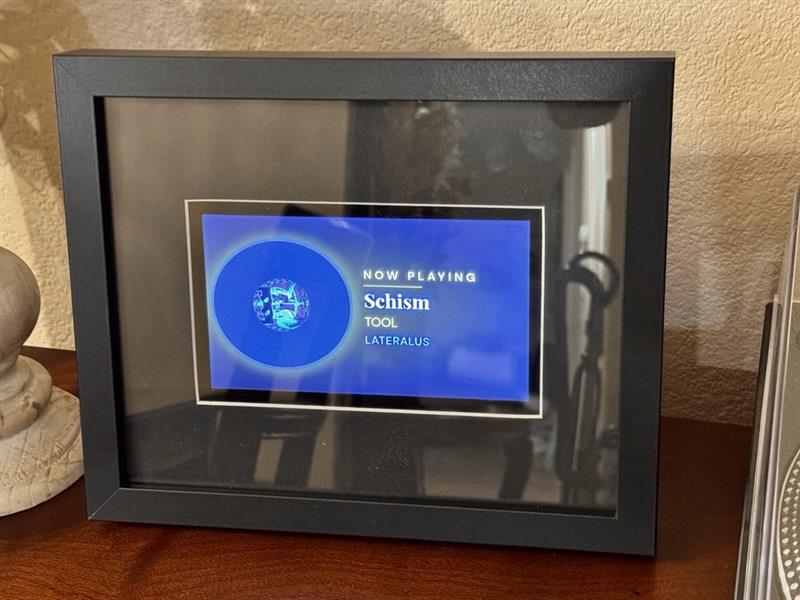
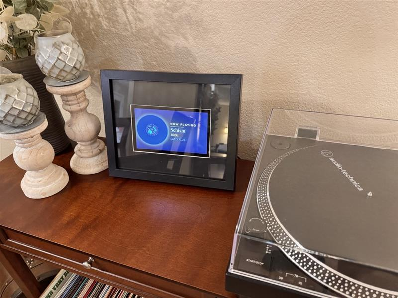

# vinylDisplay 🎵

A Raspberry Pi powered "Now Playing" display for your vinyl turntable. Detects what record is playing using ACRCloud audio fingerprinting and displays the album art, song title, artist and album name on a wall-mounted screen.





## Hardware Required

| Part | Notes | ~Cost |
|---|---|---|
| Raspberry Pi Zero 2 WH | Pre-soldered headers | ~$15 |
| ReSpeaker 2-Mics Pi HAT V2.0 | Microphone HAT | ~$15 |
| 5"–7" HDMI Display | Any HDMI display | ~$45 |
| Mini HDMI → HDMI cable | Pi Zero has mini HDMI | ~$6 |
| Dual USB power supply | 5V 2A per port | ~$12 |
| MicroSD Card 16GB+ | For the OS | ~$8 |

**Total: ~$101**

## Software Requirements

- Raspberry Pi OS Trixie Lite 64-bit
- ACRCloud account — free tier includes 500 requests/day

## Before You Install

You must have the following ready before running the installer:

1. A free ACRCloud account at [acrcloud.com](https://acrcloud.com)
2. A project created in the ACRCloud console with:
   - **Audio Source:** Recorded Audio
   - **Audio Engine:** Audio Fingerprinting
   - A bucket attached to the project
3. Your **ACRCloud Host**, **Access Key** and **Access Secret** from the project dashboard

## OS Setup

1. Download **Raspberry Pi OS Trixie Lite 64-bit** using [Raspberry Pi Imager](https://www.raspberrypi.com/software/)
2. In Imager settings (gear icon) configure:
   - Hostname: `nowplaying`
   - Enable SSH
   - Set your WiFi SSID and password
   - Set username: `pi` and a password
3. Flash to SD card, insert into Pi and boot
4. SSH in: `ssh pi@nowplaying.local`

## Installation

Once SSH'd into your Pi run the one-line installer:

```bash
curl -sSL https://raw.githubusercontent.com/ingo916/vinylDisplay/main/install.sh | bash
```

The installer will:
- Prompt for your ACRCloud credentials
- Install all system and Python dependencies
- Install ReSpeaker HAT drivers
- Download and configure all project files
- Set up the kiosk display
- Configure WiFi fallback hotspot
- Enable everything to start on boot

When complete reboot:

```bash
sudo reboot
```

## How It Works
```
ReSpeaker HAT → records 10s of audio → sends to ACRCloud
→ gets back song/artist/album → displays on screen
```
- While no music is detected the screen shows a pulsing idle animation
- When a song is identified it fades in with the spinning vinyl disc and album art
- Album art is fetched from ACRCloud or falls back to the iTunes API
- The display polls for new songs every 25 seconds

## WiFi Setup

If you move the display to a new location with no known WiFi networks the Pi will broadcast a hotspot called `NowPlaying-Setup` (password: `nowplaying`).

Connect your phone or laptop to that network and go to:
`http://192.168.4.1:5000/wifi`

Select your network, enter the password and the Pi will connect and reboot automatically.

You can also access the WiFi selector anytime while connected at:
`http://nowplaying.local:5000/wifi`

## Testing Without a Microphone

Simulate a now playing state by writing to the state file:

```bash
echo '{
  "status": "playing",
  "title": "Cruel Summer",
  "artist": "Taylor Swift",
  "album": "Lover",
  "art_url": "https://upload.wikimedia.org/wikipedia/en/c/cd/Taylor_Swift_-_Lover.png"
}' > ~/vinylDisplay/nowplaying.json
```

Return to idle:

```bash
echo '{"status": "listening", "title": "", "artist": "", "album": "", "art_url": ""}' > ~/vinylDisplay/nowplaying.json
```

## Project Structure
```
vinylDisplay/
├── app.py                  Flask server + audio detection loop
├── install.sh              One-line installer
├── README.md
├── templates/
│   ├── index.html          Main display UI
│   └── wifi.html           WiFi setup portal
├── static/
│   └── style.css           Display styling
└── config/
    └── vinylapp.service    Systemd service file
```

## Troubleshooting

**White screen on display** — Chromium crashed due to low memory. It will auto-restart in 5 seconds.

**No song detected** — Check mic placement. The ReSpeaker should be within 3–6 feet of the turntable speaker facing it.

**Can't reach nowplaying.local** — Try the IP address directly. Find it with `hostname -I` on the Pi.

**ReSpeaker not detected** — Run `arecord -l` and confirm the seeed device appears. If not check the HAT is fully seated on the GPIO pins.

## Credits

- Audio fingerprinting by [ACRCloud](https://acrcloud.com)
- Album art fallback from [iTunes Search API](https://developer.apple.com/library/archive/documentation/AudioVideo/Conceptual/iTuneSearchAPI)
- Built for Raspberry Pi OS Trixie 64-bit
- Hardware: Raspberry Pi Zero 2 WH + ReSpeaker 2-Mics Pi HAT V2.0